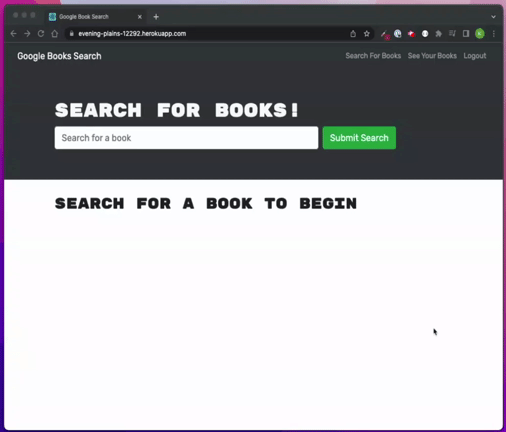

# Book Search

## Table of Contents

- [Description](#description)
- [User Story](#user-story)
- [Features](#features)
- [Technologies](#technologies)
- [Website](#website)
- [Installation](#installation)

## Description

A full-stack application that allows users to search for books by author or title and save books to their profile. Built using the MERN stack, GraphQL, and Google Books API.

## User Story

As a user interested in books, I would like an application that allows me to search for books by title or author, and save books that I can easily reference in the future.

## Features

When first visiting the homepage, users can search for books by title or author.

Users have the option to sign up for an account. When logged in, users can save books they can reference later.

Users can also delete books from their saved books list.

## Technologies

- Node.js
- Express.js
- React
- Mongoose
- MongoDB
- GraphQL
- JavaScript
- React
- Apollo
- Google Books API

## Website

https://evening-plains-12292.herokuapp.com/

## Installation

This program can be run through a browser using the above link to the deployed application. In order to run this program locally, follow the steps below:

1. Clone the repo using `git clone`.
2. Navigate to the root directory of the application in the terminal.
3. Run `npm install` to download all necessary dependancies.
4. Run `npm run develop` to compile the application and start the server.
5. Navigate to http://localhost:3000 in your browser to view the application.
6. To stop running the server and exit the application, type `CTRL + C` in the terminal.
